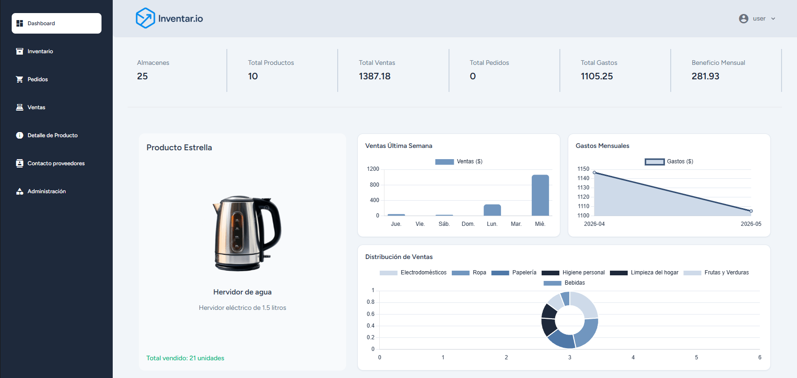
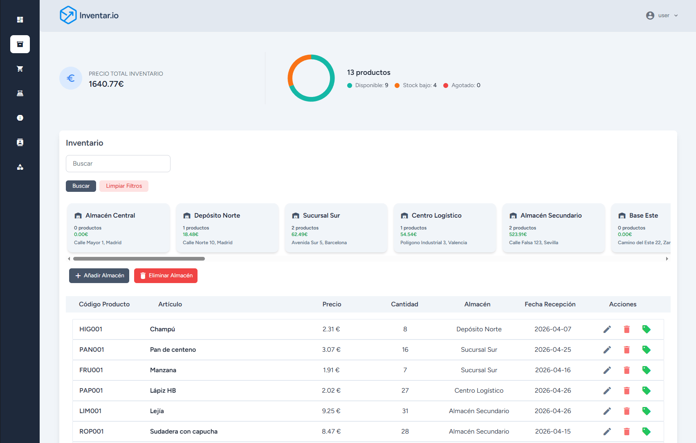
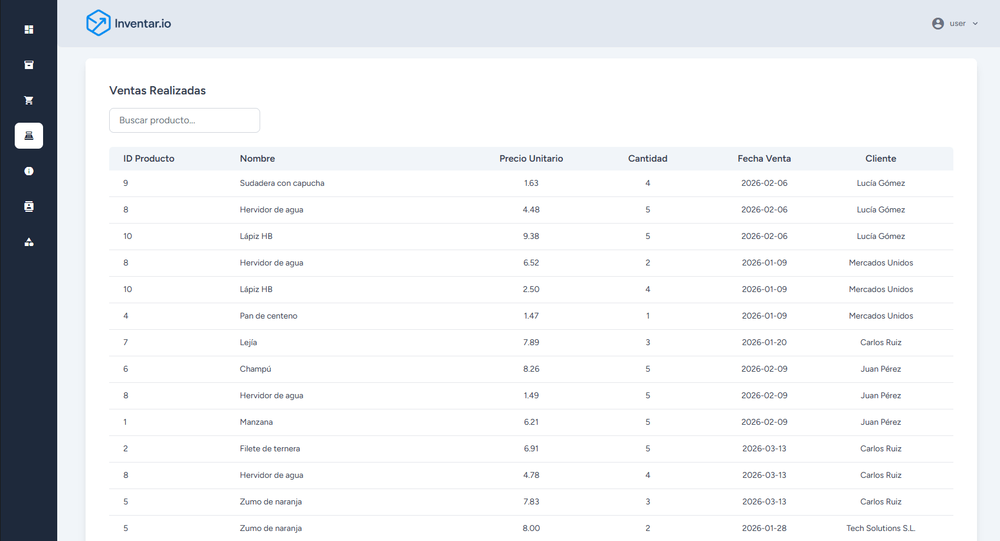
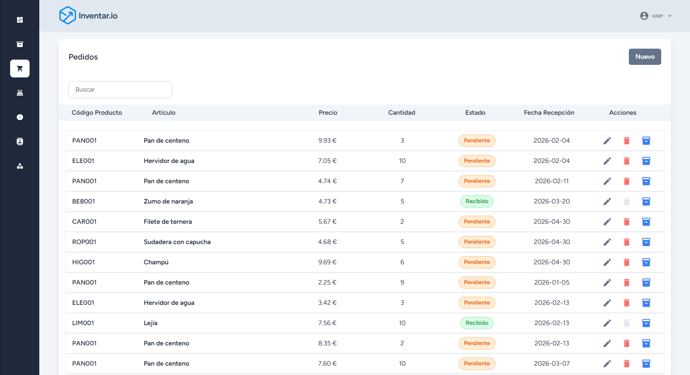
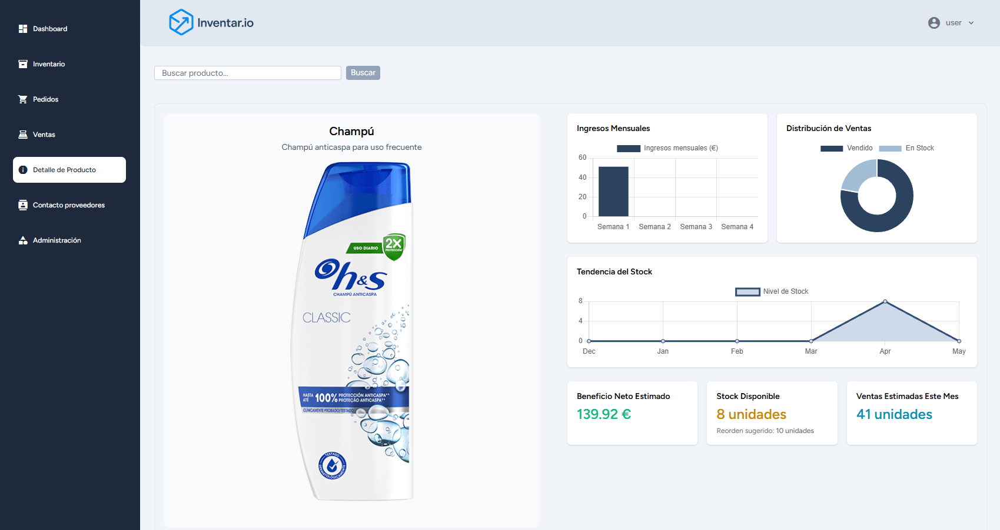

# 🧾 Inventar.io

[](https://github.com/javi2398/inventar.io/actions/workflows/tests.yml)


**Inventar.io** es una aplicación web de **gestión de inventario** orientada a **autónomos, mayoristas y pequeños negocios**.  
Permite registrar compras, ventas, stock y gastos de forma sencilla, centralizando toda la información comercial en una sola plataforma accesible desde cualquier dispositivo.

---

## 📚 Sobre el proyecto

**Inventar.io** es el resultado de mi **Proyecto Fin de Grado** del ciclo de **Desarrollo de Aplicaciones Web (DAW)**.

> Tras la entrega y defensa del TFG, el proyecto ha seguido evolucionando: migración de la base de datos de **MySQL a PostgreSQL**, suite de **pruebas automatizadas con PHPUnit** e **integración continua con GitHub Actions**.

---

## 🖼️ Vista previa

### Dashboard analítico

<p align="center">
  
</p>

### Flujos principales

| Inventario | Ventas |
|:---:|:---:|
|  |  |
| **Pedidos a proveedores** | **Detalles del producto** |
|  |  |

### Acceso

<p align="center">
  
</p>

---

## 🚀 Características principales

### Funcionalidades del TFG

- 📦 Gestión completa de **inventario**: productos, almacenes, categorías, compras, ventas y gastos.
- 📊 **Dashboard analítico** con estadísticas y control de stock en tiempo real (Chart.js).
- 👥 Sistema de **autenticación y usuarios** protegidos (Laravel Breeze + Auth Middleware).
- 🏢 Gestión de **entidades**: clientes, proveedores, almacenes y categorías con CRUD completo.
- 🛒 **Flujo de ventas**: registro de operaciones con descuento automático de stock.
- 📥 **Flujo de compras**: pedidos a proveedores y entrada de mercancía al inventario.
- 🖼️ Subida y gestión de imágenes con **Cloudinary**.
- 🔍 Búsqueda, filtrado y paginación de productos.
- 💻 Interfaz SPA moderna desarrollada con **React + Inertia + Tailwind CSS**.
- ☁️ Despliegue en **Laravel Cloud** (entorno de producción).

### Mejoras posteriores al TFG

- 🐘 **Migración de MySQL a PostgreSQL**: actualización del stack de base de datos, traducción de SQL específico (`DATE_FORMAT`, `WEEK`, `SHOW TABLES`...) y configuración del entorno Docker.
- 🧪 **Suite de tests con PHPUnit**: tests cubriendo modelos, relaciones, controladores y autenticación. Ejecución contra una base de datos PostgreSQL real para máxima fidelidad.
- 🤖 **Integración Continua con GitHub Actions**: cada push y Pull Request a `main` dispara el workflow que levanta Postgres, instala dependencias, compila assets de Vite y ejecuta toda la suite.
- 🔒 **Branch protection**: `main` solo aceptable vía Pull Request con tests verdes.

---

## 🧩 Stack tecnológico

| Capa | Tecnología | Descripción |
|------|------------|-------------|
| **Frontend** | React 18, Inertia.js, Tailwind CSS, Vite | Interfaz SPA dinámica y responsiva |
| **Backend** | Laravel 12 (PHP 8.4) | Lógica del servidor y rutas |
| **Base de datos** | PostgreSQL 16 | Gestión relacional de datos |
| **Almacenamiento** | Cloudinary | Gestión y optimización de imágenes |
| **Tests** | PHPUnit 11 | tests automatizados |
| **CI/CD** | GitHub Actions | Pipeline de tests en cada push y PR |
| **Contenedores** | Docker + Docker Compose | Entorno reproducible para desarrollo |
| **Despliegue** | Laravel Cloud | Hosting de producción |

---

## 🎮 Demo

🌐 **Aplicación desplegada**: [inventario.free.laravel.cloud](https://inventario.free.laravel.cloud)

**Credenciales de prueba** (tras ejecutar los seeders):

- Usuario: `user@gmail.com`
- Contraseña: `password`

---

## ⚙️ Instalación

### Opción A — Docker (recomendada)

Construir y arrancar los contenedores:

```bash
docker compose up -d
```

Ejecutar migraciones y seeders dentro del contenedor:

```bash
docker compose exec app php artisan migrate --seed
```

Ver logs en tiempo real:

```bash
docker compose logs -f
```

Parar los contenedores:

```bash
docker compose down
```

El proyecto queda disponible en:

- **Aplicación**: http://localhost:8000
- **pgAdmin**: http://localhost:8080 (usuario: `admin@inventar.io`, contraseña: `password`)

### Opción B — Instalación nativa

Requisitos previos:

- PHP **8.4** con extensión `pdo_pgsql` habilitada
- Composer 2
- Node.js 20+
- PostgreSQL 16

Pasos:

```bash
# Backend
composer install
cp .env.example .env
php artisan key:generate
```

Edita el `.env` con tus credenciales de PostgreSQL:

```env
DB_CONNECTION=pgsql
DB_HOST=127.0.0.1
DB_PORT=5432
DB_DATABASE=inventario
DB_USERNAME=postgres
DB_PASSWORD=password
```

Migra y siembra:

```bash
php artisan migrate --seed
php artisan serve
```

Frontend:

```bash
npm install
npm run dev
```

---

## 🧪 Tests

La suite de tests usa la base de datos `inventario_testing` del mismo contenedor de Postgres definido en `docker-compose.yml` (se crea automáticamente la primera vez que se inicializa el volumen, vía `docker/postgres-init/init.sql`).

### Ejecutar la suite en local

```bash
# 1. Levantar Postgres si no está arriba
docker compose up -d postgres

# 2. Ejecutar la suite completa
./vendor/bin/phpunit

# 3. Filtrar por nombre de test
./vendor/bin/phpunit --filter ProductoController
```

### Cobertura

| Categoría | Tests | Descripción |
|-----------|-------|-------------|
| Smoke + Auth | 34 | Health check, login, registro, recuperación de contraseña, perfil |
| Modelos | 23 | Relaciones Eloquent (belongsTo, hasMany, belongsToMany), accesores |
| Controladores web | 42 | CRUD de productos, almacenes, categorías, clientes, proveedores, ventas y compras |
| **Total** | **99** | **209 assertions, ~11s** |

### Integración Continua

Cada `push` a `main` y cada Pull Request dispara el workflow [`tests.yml`](.github/workflows/tests.yml), que:

1. Levanta un servicio Postgres 16 con la base de datos `inventario_testing`.
2. Instala PHP 8.4 con las extensiones necesarias (`pdo_pgsql`, `mbstring`, `bcmath`, `gd`, `zip`).
3. Cachea dependencias de Composer y npm para ejecuciones rápidas.
4. Compila los assets de Vite.
5. Ejecuta toda la suite de PHPUnit.

El resultado se refleja en el badge del inicio del README.

---

## 📁 Estructura del proyecto

```
inventar.io/
├── app/
│   ├── Http/Controllers/Web/   # Controladores principales (Productos, Ventas, Compras...)
│   └── Models/                 # 11 modelos Eloquent
├── database/
│   ├── factories/              # 12 factories para tests
│   ├── migrations/             # Schema de la base de datos
│   └── seeders/                # Datos demo
├── resources/js/
│   ├── Components/             # Componentes React reutilizables
│   └── Pages/                  # Páginas Inertia
├── routes/
│   └── web.php                 # Definición de rutas
├── tests/
│   ├── Feature/Auth/           # Tests de autenticación
│   ├── Feature/Models/         # Tests de modelos
│   └── Feature/Web/            # Tests de controladores web
├── docker/
│   ├── apache/                 # Config de Apache
│   └── postgres-init/          # Script de inicialización de Postgres (BD de tests)
└── .github/workflows/          # Workflows de GitHub Actions
```

---

## 📜 Licencia

[MIT](LICENSE) — uso libre con atribución.

---

## 👤 Autor

Desarrollado por **Javier Vigara Valentín** ([@javi2398](https://github.com/javi2398))

Proyecto Fin de Grado — Ciclo Formativo de Grado Superior en Desarrollo de Aplicaciones Web (DAW).
